# Challenge One PACS

First challenge of the advanced programming for scientific computing. The task is to solve the minimization problem through different methods.

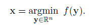

## Methods
Given an initial guess I applied three techniques to solve the minimization problem. 
I considered the following three convergence conditions:
+ control on the step length

  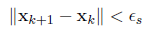

+ control on the residual

  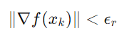

+ limit of the max number of iterations

  

The three methods are:

+ **Gradient method**

    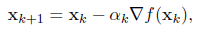

+ **Heavy ball method**

    The first iteration is set

    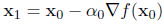   

    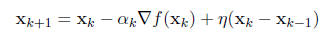

+ **Nesterov method**

    The first iteration is set

       

    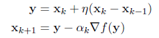

There are three methods to compute alpha:

+ **Armijo rule**

    It is a possible technique to solve the line search problem. It has to check if the sufficient decrease condition is satisfied:

    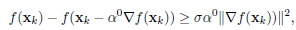   

    If it is not satisfied set alpha:

    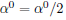   

    and check the decrease condition as long as it is satisfied.

+ **Exponential decay**

    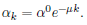   

+ **Inverse decay**

    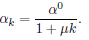   

The Armijo rule can't be used in the Nesterov method and in the Heavy ball method since the direction d_k cannot be guaranteed to be a descent direction.

The gradient can be computed by the finite differences or one can used the exact gradient.

## Organization of the code

In the folder `src` there are:
+ [main.cpp](https://github.com/gr3taa/Challenge_One/blob/main/src/main.cpp)
+ [helper.hpp](https://github.com/gr3taa/Challenge_One/blob/main/src/helper.hpp)
+ [met.hpp](https://github.com/gr3taa/Challenge_One/blob/main/src/met.hpp)
+ [GetPot.hpp](https://github.com/gr3taa/Challenge_One/blob/main/src/GetPot)

In `helper.hpp` there are implemented some functions useful for the calculus related to vector, such as:
+ the sum between two vectors
+ the difference between two vectors
+ the product between a scalar and a vector
+ the vector norm
+ the gradient computed by finite differences

In `met.hpp` there are implemented the functions used to solve the minimization problem.

The file `GetPot` allows you to parse the arguments passed to the program from the command line.

In the `img` folder there are the images used for the `README.md`.

## Running locally

Run `make` to compile the program and then `./program` to compute the minimum.
The user can decide if he/she wants to set the parameters, simply assign the desired value to the variable name. 
+ `mu=` to set mu parameter to compute alpha in inverse and exponential decay
+ `alpha_zero=` to set the initial alpha
+ `eta=` to set the eta parameter to compute x in the Nesterov and heavy ball method
+ `max_it=` to set the maximum number of iteration
+ `sigma=` to set the sigma parameter to compute alpha with Armijo rule
+ `tol_r=` to set the tolerance for the residuals
+ `tol_s=` to set the tolerance for the step length

The user can also decide the method to use for the computation of alpha and the method to compute the gradient, to choose them one have to modified the code in the `main.cpp` at line 22, 23, 24.

